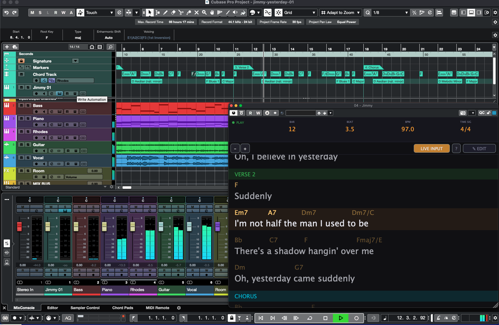

# Jimmy — Live Teleprompter for Cubase

A VST3 instrument plugin that displays **lyrics and chords** as a live teleprompter, synced to your Cubase timeline.



<a href='https://ko-fi.com/J3J41WYGJ4' target='_blank'></a>

---
## Features

- **Auto-scrolling teleprompter** — follows playback/recording position in real-time
- **Chord detection from MIDI** — route your chord track and Jimmy identifies chords automatically
- **Lyrics editor** — enter lyrics and map each line to bar positions on the timeline
- **Song sections** — define Verse, Chorus, Bridge, etc. with bar ranges
- **Hebrew/RTL support** — automatically detects and right-aligns Hebrew text
- **Dark theme** — easy to read on stage or in dim lighting
- **Zoom controls** — adjust text size for comfortable reading distance
- **Zero latency** — produces no audio, adds no CPU load to your project
- **State saved with project** — all data persists in the Cubase project file

## Quick Start

1. **Build** the plugin → see [docs/BUILD.md](docs/BUILD.md)
2. **Install** it in Cubase → see [docs/INSTALL.md](docs/INSTALL.md)
3. **Use** it → see [docs/USAGE.md](docs/USAGE.md)

## Requirements

- Cubase 12+ (or any VST3-compatible DAW)
- macOS (arm64 / Apple Silicon) or Windows

## Building from Source

```bash
git clone <repo-url> jimmy
cd jimmy
git submodule update --init --recursive
cmake -B build -DCMAKE_BUILD_TYPE=Release
cmake --build build --config Release
```

The VST3 bundle will be at `build/Jimmy_artefacts/Release/VST3/Jimmy.vst3`.

## Architecture

```
PluginProcessor (audio thread)
├── AudioPlayHead → transport position (bar, beat, BPM, time sig)
├── MIDI buffer → chord detection (ChordParser) + program changes
├── SharedState (lock-free atomics) → UI thread
└── XML state save/load (SongModel)

PluginEditor (UI thread)
├── Edit Mode: LyricsEditor, SectionManager (tabbed)
└── Live Mode: TeleprompterView (auto-scrolling)

SongModel: sections[], lyricLines[], chords[]
```

## License
MIT License. See [LICENSE](LICENSE) for details.